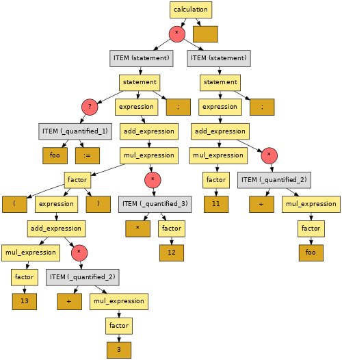
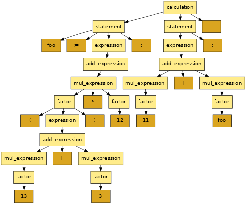
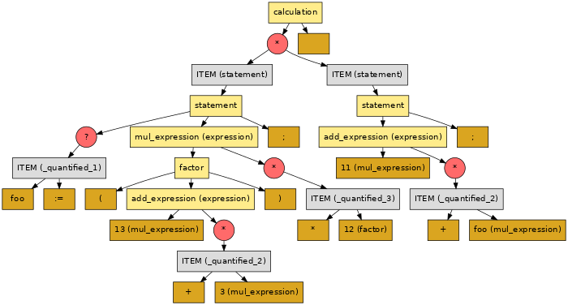
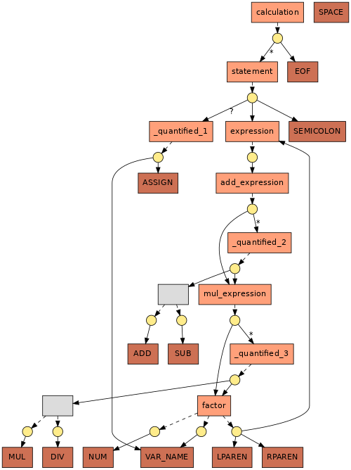

j-PEG: A PEG parsing framework for Java
=======================================

The *j-PEG* Java library takes as input a *Parsing Expression Grammar* (PEG) and constructs an
efficient *packrat parser* for it. The PEG can be either given in text form or constructed at
runtime via API calls.

*j-PEG* has been designed with performance in mind and can parse even huge programs in complex
languages in short time (we have successfully used *j-PEG* to parse fuzzer-generated programs with
hundreds or even thousands of lines of code in real-world programming languages, including C, Lua,
SQL, and SMT-LIB 2). It has been implemented as part of the
[RedPEG](https://github.com/FAU-Inf2/RedPEG) framework for test case reduction, but might be
valuable for other use cases as well.

**Note**: *j-PEG* is part of a research project and should be considered a prototype rather than a
ready-to-use PEG implementation; use with caution.

## Citations

Please refer to the following publications for some background on PEGs and packrat parsers:

- Ford, B.: Parsing Expression Grammars: A Recognition-Based Syntactic Foundation. In: POPL’04:
  Principles of Programming Languages (Venice, Italy, Jan. 2004), 111–122.
- Ford, B.: Packrat Parsing: Simple, Powerful, Lazy, Linear Time. In: ICFP’02: International
  Conference on Functional Programming (Pittsburgh, PA, Oct. 2002), 36–47.
- Tratt, L.: Direct Left-Recursive Parsing Expression Grammars. Technical Report. School of
  Engineering and Information Sciences, Middlesex University (London, United Kingdom, Oct. 2010),
  1-14.

## Building j-PEG

Simply type `./gradlew build` in the root directory of the *j-PEG* repository to build the *j-PEG*
library. After a successful build, there should be a file `build/libs/j-PEG.jar`. The instructions
below assume that this file exists.

**Note**:

- You need a working JDK installation to build and run *j-PEG* (tested with OpenJDK 8 and 11).
- Building *j-PEG* requires an internet connection to resolve external dependencies.

## Performance

As indicated above, *j-PEG* has been designed with parsing performance in mind, which resulted in
the following design decisions:

- In contrast to many other implementations, *j-PEG* strictly separates the lexer from the parser.
  This might reduce the flexibility a bit, but we found this to be fine for our use case.
- The parser uses *packrat parsing* (i.e., memoization; see the references above for more details).
  This way, its runtime is linear in the number of tokens in the input. Note, however, that the
  memoization might require a lot of memory and that *j-PEG* does currently *not* try to optimize
  the memory consumption.
- As it is known from parsing with classical context-free grammars (for details, please refer to a
  textbook on compiler construction of your choice), *j-PEG* computes the so-called *first set* for
  each rule in the given PEG. The constructed parser only tries to apply a rule if the next token in
  the input is included in the rule's first set. This reduces the number of (inevitably) failing
  attempts. In our experiments, this resulted in a considerably higher parsing performance.

## Command Line Tool

Although *j-PEG* is meant to be used as a library in other projects, it also includes a simple
command line tool, which can be run with the `run.sh` helper script. This can be handy for examining
and validating PEGs. For example, run the following to print some statistics on the parser
performance (`--parserStats`) and the resulting syntax tree (`--treeStats`):

    ./run.sh \
        --grammar example/calc_grammar.txt --in example/calc_input.txt \
        --parserStats --treeStats

When using this command line interface, the following two options are always required:

- `--grammar`: Path to the PEG that describes the syntax of the input.
- `--in`: Path to the input that should be parsed.

See the descriptions below for additional command line options.

## Example PEG

Consider the following example PEG:

    calculation: statement* EOF ;

    statement: ( VAR_NAME ASSIGN )? expression SEMICOLON ;

    expression: add_expression ;

    add_expression: mul_expression ( ( ADD | SUB ) mul_expression )* ;

    mul_expression: factor ( ( MUL | DIV ) factor )* ;

    factor
      : NUM
      | VAR_NAME
      | LPAREN expression RPAREN
      ;

    ASSIGN: ':=';
    SEMICOLON: ';';

    ADD: '+';
    SUB: '-';
    MUL: '*';
    DIV: '/';

    LPAREN: '(';
    RPAREN: ')';

    @skip
    SPACE: ( ' ' | '\n' | '\r' | '\t' )+ ;

    NUM: '0' | ( [1-9][0-9]* ) ;
    VAR_NAME: [a-zA-Z] [a-zA-Z0-9]* ;

This grammar matches programs of the following form:

    foo := (13 + 3) * 12;
    11 + foo;

### Lexer Rules

The names of lexer rules consist of upper case letters (e.g., `ASSIGN` or `SPACE`).

The right hand side of a lexer rule consists of a single regular expression (please refer to the
example above for the exact notation).

If a lexer rule is annotated with `@skip` (e.g., the `SPACE` rule from above), its matches are
discarded (i.e., its matches do not appear as tokens in the token stream).

The implicitly defined `EOF` rule matches the end of the input.

### Parser Rules

The names of parser rules consist of lower case letters (e.g., `calculation` or `statement`). The
first parser rule becomes the parser's start rule.

The right hand side of a parser rule uses a notation similar to that of EBNF:

- `*` means zero or more repetitions
- `+` means one or more repetitions
- `?` means zero or one occurrences

Use the choice operator `|` to specify alternatives. **Note**: In contrast to "traditional"
context-free grammars in EBNF, the choice operator of PEGs is *ordered*. Thus, if the first
alternative matches, the second one is ignored. For example, a rule `foo: A | A B;` only ever
matches `A` tokens (but you can swap the alternatives so that the parser first tries to match `A
B`).

### Left Recursion

Since the input PEG is converted to a recursive top-down parser, left recursive rules may lead to an
infinite recursion. We provide **experimental** support for *directly* left recursive rules, but
this has not been fully tested yet. *Indirectly* left recursive rules are currently not supported.

### Annotations

It is possible to annotate the rules for terminals and non-terminals in a PEG with one or more
*annotations*, and these annotations might optionally carry an (integer or string) argument:

    @some_annotation
    foo: ... ;

    @int_annotation(13)
    @string_annotation("value")
    bar: ... ;

Nodes in the syntax tree (see below) that belong to such an annotated definition carry these
annotations (and their optional values) for further processing.

## Constructing a PEG at Runtime

A PEG can not only be specified with a textual grammar, but can also be constructed at runtime via
API calls. For this purpose, *j-PEG* offers the `i2.act.peg.builder.GrammarBuilder` class. The
implementation in `i2.act.peg.main.CalculatorMain` shows an example for how to use this class (which
can be run with the `calculator.sh` helper script).

In a nutshell, a PEG can be constructed at runtime by instantiating a `GrammarBuilder` and by
specifying grammar rules with its `define()` and `declare()` methods. The final PEG is then
constructed by calling the `build()` method on the `GrammarBuilder`.

**Note**: To simplify the specification of grammar rules, statically import the methods that the
`GrammarBuilder` class provides:

    import static i2.act.peg.builder.GrammarBuilder.*;

This way, the `statement` rule from the example PEG above can simply be specified as follows:

    builder.define(statement,
        seq(opt(seq(VAR_NAME, ASSIGN)), expression, opt(SEMICOLON)));

## Syntax Trees

If the input can be parsed according to the given PEG, *j-PEG* builds a syntax tree ready for
further processing. In such a syntax tree, the inner nodes represent the rules of non-terminals that
were applied during parsing, whereas the leave nodes represent the matched terminals (i.e., the
tokens of the input).

By default, the syntax trees constructed by *j-PEG* contain quantifier nodes that represent matches
of quantified sub-rules; the children of such quantifier nodes are implicit `ITEM` nodes (this
ensures that each match of the quantified sub-rule is represented as a single sub-tree with a single
root node, even if the quantified sub-rule consists of multiple symbols). Thus, the default syntax
tree for the example language and input from above looks as follows:

Quantifier and `ITEM` nodes can be omitted by setting the respective parameter when constructing the
parser accordingly (when using the command line tool, add the `--omitQuantifiers` flag). In the
example, this results in the following syntax tree:

### Compactification

Syntax trees may contain long linear chains of nodes. *j-PEG* can optionally collapse such chains to
single nodes to reduce the size of the syntax trees. In the example, this results in the following
syntax tree:

To compactify a syntax tree, simply call the `compactify()` method on it (the command line tool
compactifies syntax trees by default; use the `--noCompactify` flag to disable the
compactification).

To not lose the information which non-terminal the root of a collapsed chain originally had,
compactified nodes store the original non-terminal as *expected symbol* (included in parantheses in
the image above), which can be retrieved with the method `getExpectedSymbol()`.

### Tree Visitors

For processing syntax trees, *j-PEG* offers the class `i2.act.packrat.cst.visitors.TreeVisitor`,
which allows the definition of a visitor that traverses a syntax tree and that executes specific
code for different nodes.

The implementation in `i2.act.peg.main.CalculatorMain` shows an example for how to define such a
visitor. In a nutshell, first construct a new instance of the `TreeVisitor` class. The type
parameters `P` and `R` specify the type of the (single) parameter of the visitor methods and their
return type, respectively. Then, (repeatedly) call the `add()` method on the newly created visitor
to register visit methods for the different symbols (i.e., terminals and non-terminals) of the
grammar. To run the visitor, call the `visit()` method and pass the syntax tree and the original
argument for the visit methods.

## Grammar Graphs

Some applications might need to further analyze a given PEG and *j-PEG* comes with some support for
such analyses.

A given PEG induces a bi-partite graph, which *j-PEG* refers to as *grammar graph* and which it
represents as an instance of the class `i2.act.grammargraph.GrammarGraph`. The nodes of such a
grammar graph are either *alternative nodes* (which represent choices in the grammar; this includes
all terminals and non-terminals of the grammar) or *sequence nodes* (which, as the name implies,
represent sequences in the grammar). The edges from alternative nodes to sequence nodes are called
*alternative edges* and the edges from sequence nodes to alternatives nodes are called *sequence
edges* (such sequence edges are annotated with the respective quantifier from the grammar, if any).

For the example PEG from above, the grammar graph looks as follows (rectangular nodes are
alternative nodes and circular nodes are sequence nodes):

To provide a common basis for different analyses of such grammar graphs, *j-PEG* includes the class
`i2.act.grammargraph.properties.PropertyComputation`. Currently, there is no example for such an
analysis in this repository, but the repository of the aforementioned
[RedPEG](https://github.com/FAU-Inf2/RedPEG) framework contains several analyses (for example, the
*RedPEG* class `i2.act.grammargraph.properties.SubsumptionComputation` analyzes a PEG to find out
which non-terminals *subsume* which other terminals and non-terminals of the grammar).

## License

*j-PEG* is licensed under the terms of the MIT license (see [LICENSE.mit](LICENSE.mit)).

*j-PEG* makes use of the following open-source projects:

- Gradle (licensed under the terms of Apache License 2.0)
